# Security Log Analysis Dashboard

A comprehensive web-based dashboard for analyzing Apache web server security logs, built using AWS services, Elasticsearch, and Flask.

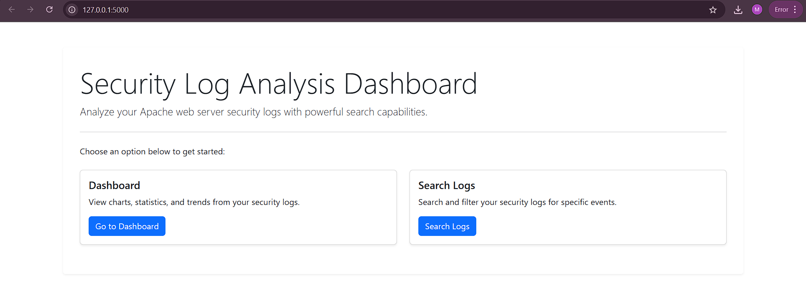

## Project Overview

This Security Log Analysis Dashboard processes and visualizes Apache web server logs to provide security insights and identify potential threats. The dashboard offers a comprehensive view of server activity, error patterns, and potential security incidents through intuitive visualizations.

## Features

- **Summary Statistics**: At-a-glance view of total logs, error rates, and potential attack counts
- **Time-Based Analysis**: Interactive charts showing request volume and error responses over time
- **IP-Based Analysis**: Visualization of top source IP addresses making requests to your server
- **Response Analysis**: HTTP status code distribution to identify unusual response patterns
- **Security Analysis**: Detection and visualization of potential attack patterns in request URLs
- **Search Functionality**: Ability to search and filter logs based on various criteria

## Architecture

The system follows an ETL (Extract, Transform, Load) pipeline architecture:

1. **Data Storage**: Raw Apache logs are stored in AWS S3
2. **Data Cataloging**: AWS Glue Crawler catalogs the raw log data
3. **Data Processing**: AWS Glue ETL job transforms raw logs into structured data with security metrics
4. **Indexing**: Transformed data is indexed in Elasticsearch for fast querying
5. **Visualization**: Flask web application queries Elasticsearch and renders the dashboard

## Technologies Used

- **AWS S3**: Storage for raw and transformed log data
- **AWS Glue**: Data cataloging and ETL processing
- **Elasticsearch**: Fast indexing and searching of log data
- **Flask**: Web application framework
- **Chart.js**: JavaScript library for interactive data visualizations
- **Bootstrap**: Frontend styling and responsive design

## Setup Instructions

### Prerequisites

- AWS Account with access to S3 and Glue services
- Elasticsearch (local installation or AWS Elasticsearch Service)
- Python 3.6+ with pip
- Apache log files (sample provided)

### Installation Steps

1. **Clone the repository**
  ```bash
  git clone https://github.com/sonali-rajput/security-log-dashboard.git
  cd security-log-dashboard
  ```

2. **Create a virtual environment and install dependencies**
  ```bash
  python -m venv venv
  venv\Scripts\activate
  pip install -r requirements.txt
  ```
3. **Do the same for Flask as well**
  ```bash
  cd security-dashboard
  python -m venv venv
  venv\Scripts\activate
  pip install -r requirements.txt
  ```

4. **Set up AWS resources**

### Part 1: Extract

- Create an IAM Role for whole project (Use cases for other AWS services : Select Glue) <br>
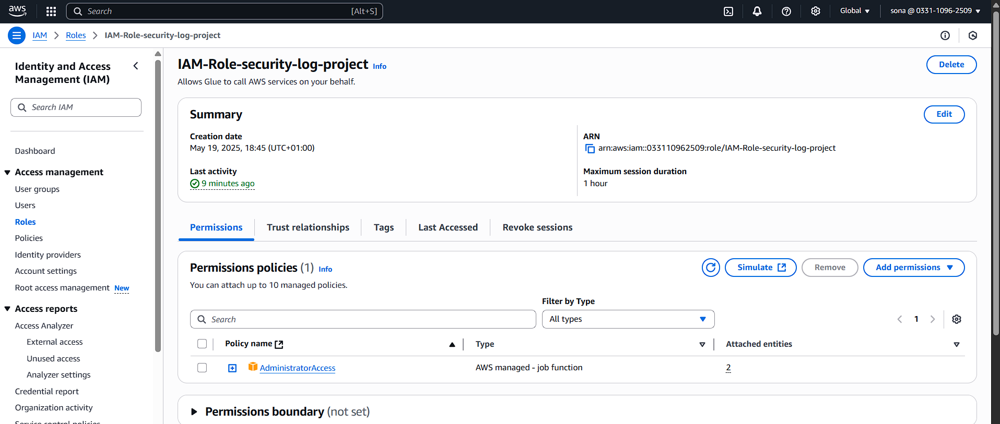
<br>

- Create an S3 bucket with a databse folder
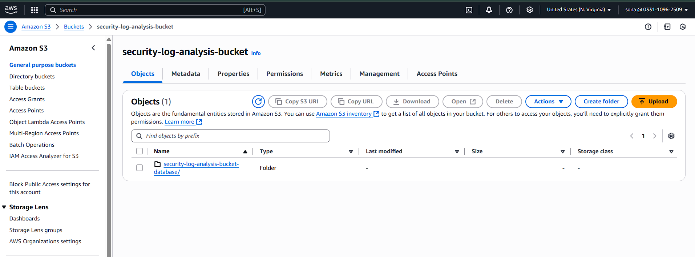
<br>

- Inside the database folder create folders for raw and transformed data
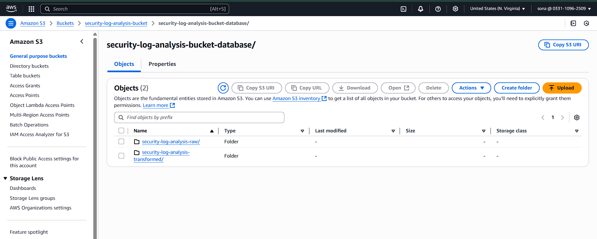
<br>

- Upload Apache logs to the raw data folder
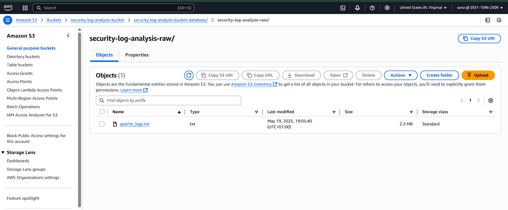
<br>

- Create a Glue database and set up a crawler to catalog the raw logs
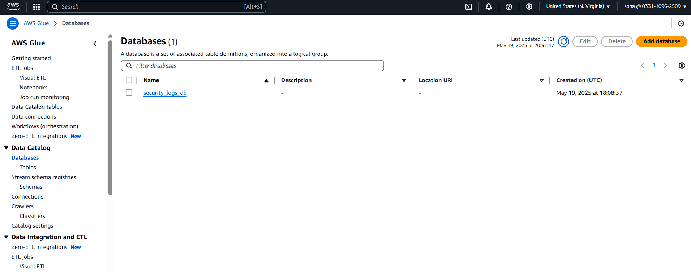
<br>

- Run the crawler for raw logs you just created. After crawler is successfully completed. Let’s check the table and schema of our table.
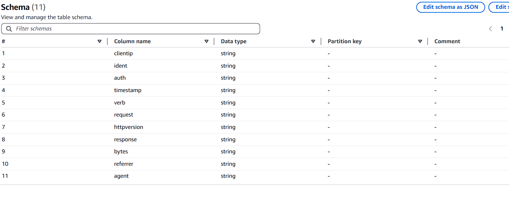
<br>

### Part 2: Transform
- Create ETL Job in AWS Glue (here we create Notebook, you can use Glue ETL scripts as well) <br>
Choose the IAM role which you created for glue <br>
The Notebook will look like [apache_logs_transformation.ipynb](https://github.com/sonali-rajput/security-log-dashboard/blob/main/apache_logs_transformation.ipynb) 


- The transformed data will be created after you are done running the Notebook (You can verify this in the S3 bucket ) <br>
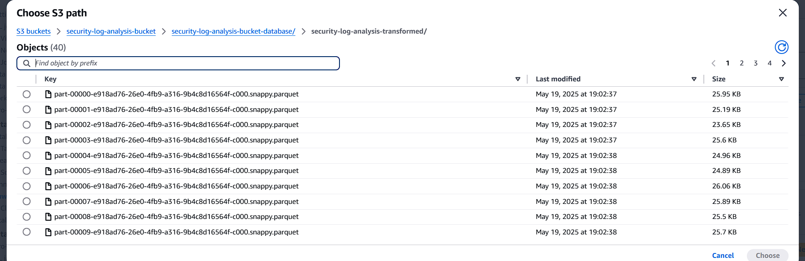 
<br>


- Create another crawler for transformed data <br>
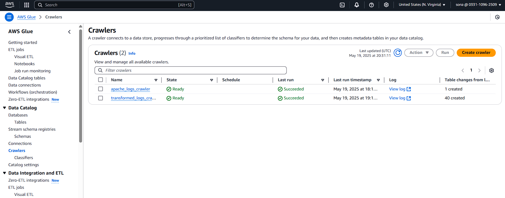
<br>

- Check the AWS Glue Databases tables and you will see the transformed data table as well when the crawler is done running. <br>
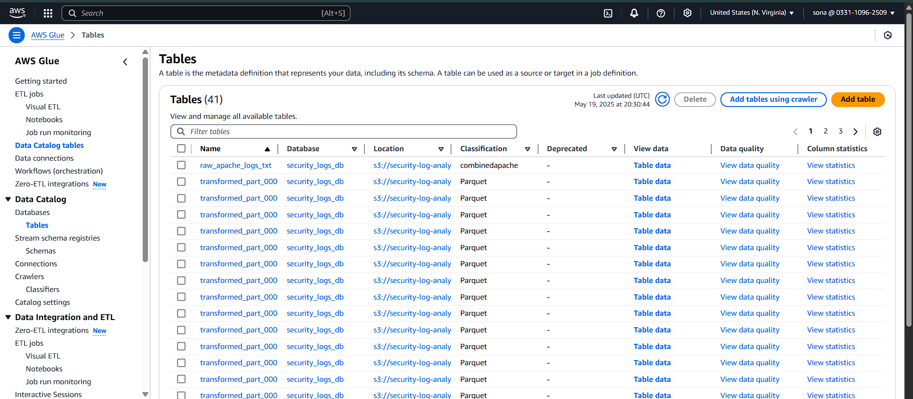

<br>

5. **Set up Elasticsearch**
- Install Elasticsearch locally or use AWS Elasticsearch Service <br>
I did it locally and removed security authenticaation (recommended for local development only) <br>
To remove security auth add this in config/elasticsearch.yml at the end <br>
  ```bash
  xpack.security.enabled: false
  discovery.type: single-node 
  ```
  <br>


6. **Load data into Elasticsearch**
- Create an index for security logs with appropriate mappings
- To do this run the provided data loading script: 
```bash
python load_to_elasticsearch.py
```
7. **Create Flask Application**
- The HTML, CSS and JS code is present [here](https://github.com/sonali-rajput/security-log-dashboard/tree/main/security-dashboard) for webdashboard. <br>

8. **Run the application**
```bash
python app.py
```
9. **Access the dashboard**
- Open a browser and navigate to ```http://localhost:5000```
- Access the ```/dashboard``` 
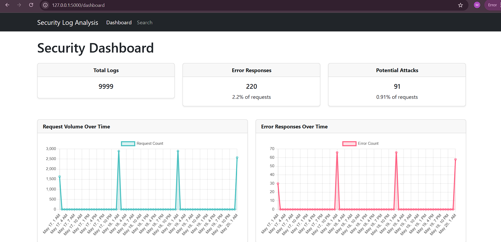 <br>
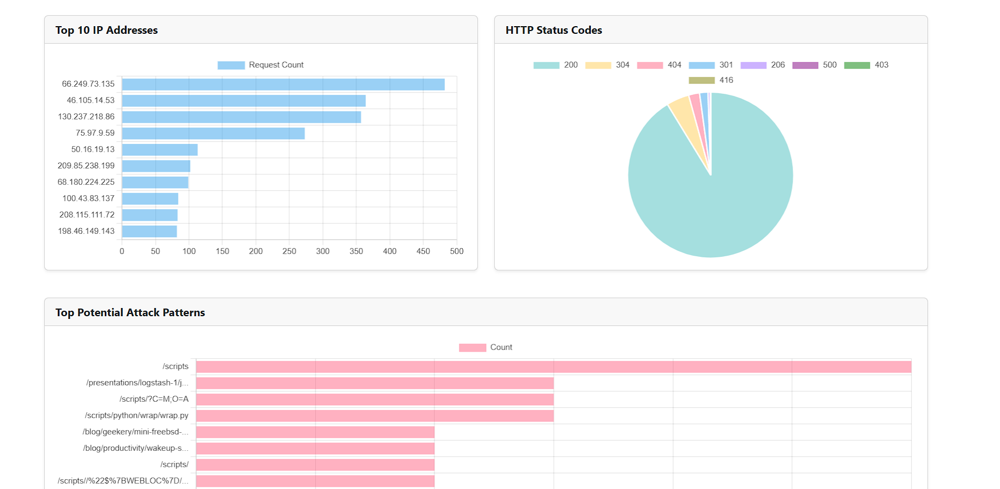

<br>

- Access the ```/search``` 
- You can use search query for example to query based on status code:```400```
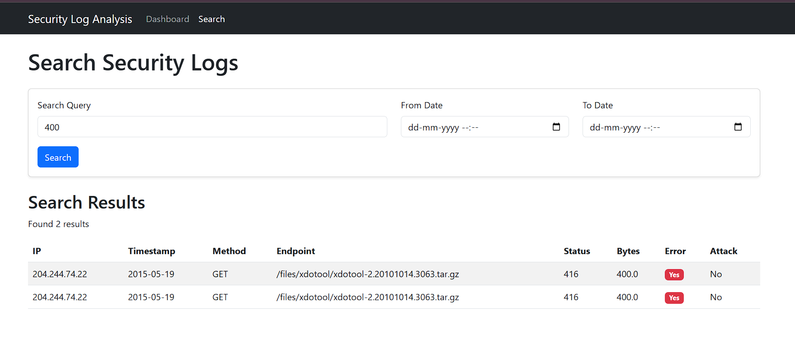
<br>

- Another Example to search based on IP address
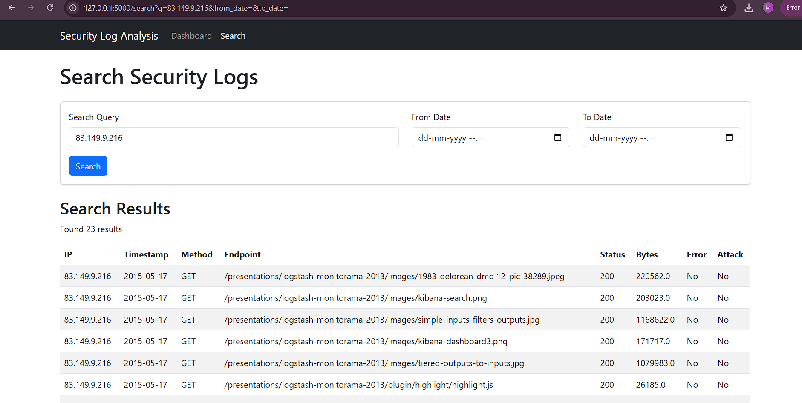
<br> 

### Security Metrics

## The dashboard analyzes logs to identify:

- Client errors (4xx status codes) indicating potential unauthorized access attempts
- Server errors (5xx status codes) that might indicate server vulnerabilities
- Suspicious URL patterns (e.g., paths containing SQL injection or XSS patterns)
- Unusual access patterns by IP address
- Temporal patterns of access (time-of-day analysis)

### Resources

- Sample security logs: https://github.com/elastic/examples/tree/master/Common%20Data%20Formats/apache_logs
- AWS Glue tutorial: https://github.com/askintamanli/Data-Engineer-ETL-Project-Using-Spark-with-AWS-Glue3

*This project was developed as a personal learning project to explore log analysis techniques and security visualization.*